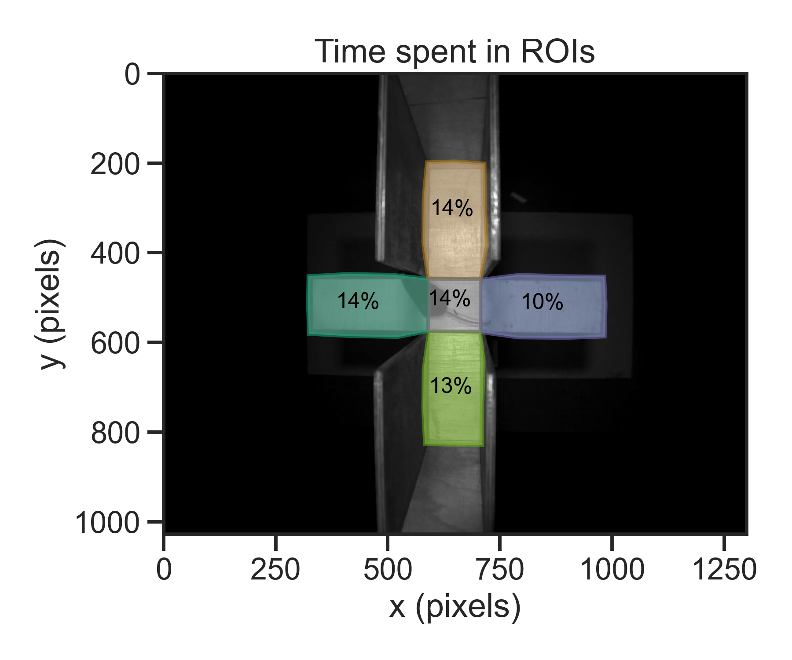
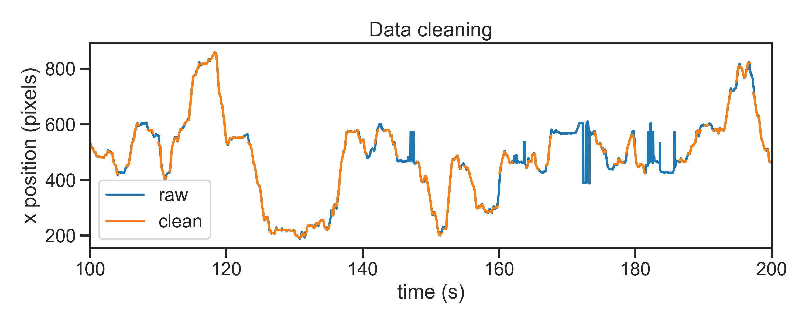
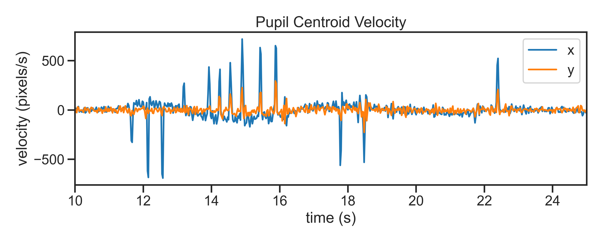
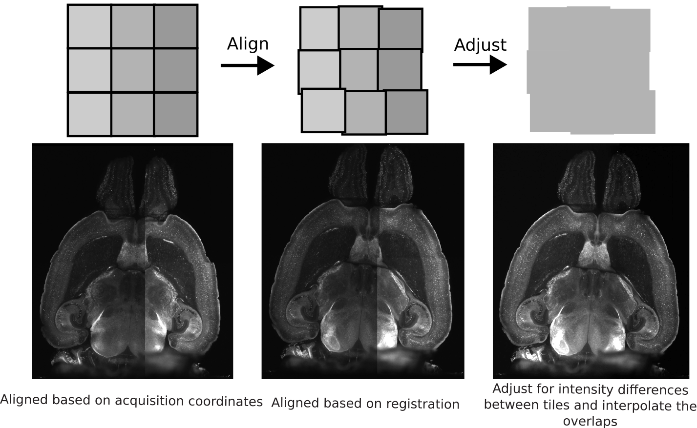
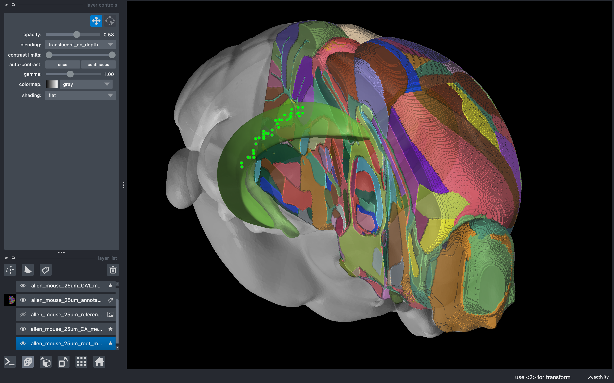
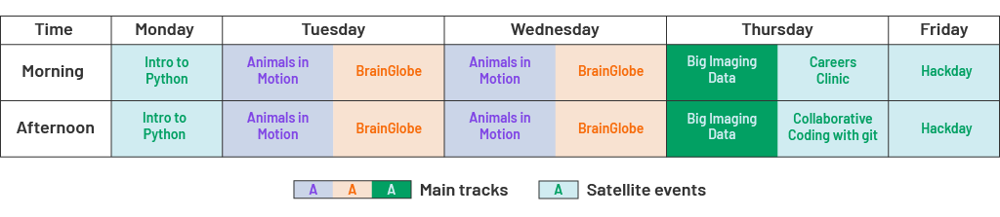
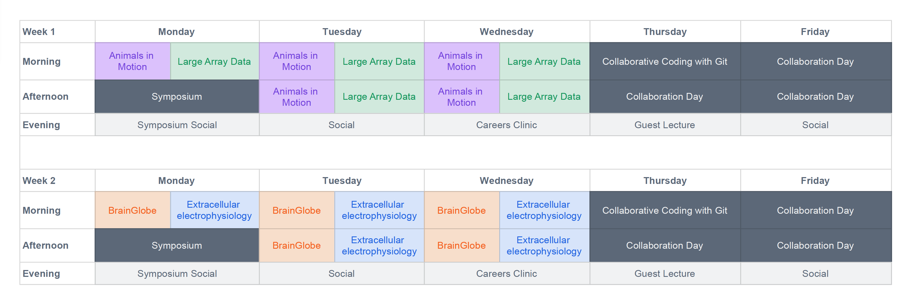

## Neuroinformatics Unit
::: {.incremental}
Domain-specific research software engineering team

* Point of contact for help & advice
* Formal & informal teaching, project support
* Software development
  * Data management, processing, visualisation & analysis
  * Focus on accuracy, robustness, maintainability & ease of use
:::

## Status - 2025
::: {.fragment}
::: {layout-nrow=1}

:::
:::
::: {.fragment}
- 2 summer interns (funded by google)
- ~50 active collaborators/contributors
- Develop and maintain >30 software tools
:::

# Data management

## The NeuroBlueprint specification {.smaller}

::: footer
[neuroblueprint.neuroinformatics.dev](https://neuroblueprint.neuroinformatics.dev/){fig-align="center"}
:::

## `datashuttle` {.smaller}

:::: {.columns}

::: {.column width="60%"}
{fig-align=left}
:::

::: {.column width="40%"}

::: {.fragment}
- Create & validate projects
- Sync data between machines/storage
- Log all actions
- In use at SWC, GCNU & labs around the world
:::

:::
::::

::: footer
[datashuttle.neuroinformatics.dev](https://datashuttle.neuroinformatics.dev/){fig-align="center"}
:::

# Movement

## Markerless pose estimation

:::: {.columns}

::: {.column width="60%"}

:::

::: {.column width="40%"}

:::
::::

## What happens after tracking?

## `movement`{.smaller}

{height=450}

::: aside
 ~60k downloads 

 >25 contributors

:::

::: footer
[movement.neuroinformatics.dev](https://movement.neuroinformatics.dev/)
:::

## `movement` example applications {.smaller}

::: {layout="[[25, 25, 20, 20], [40, 20, 40]]"}

::: {.fragment fragment-index=2}

:::

::: {.fragment fragment-index=2}

:::

::: {.fragment fragment-index=3}

:::

::: {.fragment fragment-index=3}

:::

::: {.fragment fragment-index=1}

:::

::: {.fragment fragment-index=4}

:::

::: {.fragment fragment-index=4}

:::

:::

::: aside
[movement.neuroinformatics.dev](https://movement.neuroinformatics.dev/) > Examples
:::

::: footer
[Sample data](https://movement.neuroinformatics.dev/user_guide/input_output.html#sample-data): __Elevated Plus Maze__ from *Loukia Katsouri* | __Pupil Tracking__ from *Sepi Keshavarzi*.
:::

## Future

- Specialised modules
  -  Gait analysis, pupillometry, collective behaviour
- Improved outlier detection & QC
- Integration with neurophysiological data, leveraging NWB and pynapple

# BrainGlobe
## BrainGlobe {.smaller}

::: {.columns}
::: {.column width="55%"}
Established 2020 with three aims:

:::{.incremental}
1. Develop general-purpose tools to help others build interoperable software
2. Develop specialist software for specific analysis and visualisation needs
3. Build an ecosystem and community of computational neuroanatomy tools and users
:::

:::
::: {.column width="45%"}

:::
:::

## BrainGlobe Atlas API
### [`brainglobe-atlasapi`](https://github.com/brainglobe/brainglobe-atlasapi)
{fig-align="center"}

::: footer
[Claudi, Petrucco, Tyson et al. JOSS (2020)](https://doi.org/10.21105/joss.02668)
:::

## Version 1

Tools for:

* Whole-brain atlas registration
* Whole-brain cell detection
* Analysis of implanted devices
* 3D visualisation

# Version 2
Expanding access

## Supporting mesoSPIM
{fig-align="center"}

::: footer
[github.com/brainglobe/brainglobe-stitch](https://github.com/brainglobe/brainglobe-stitch)
:::

## Consistent napari environment
{fig-align="center"}

::: footer
[github.com/brainglobe/brainrender-napari](https://github.com/brainglobe/brainrender-napari)
:::

## Support for more data types
{fig-align="center"}

::: footer
[github.com/brainglobe/brainglobe-registration](https://github.com/brainglobe/brainglobe-registration)
:::

## Building novel atlases
{fig-align="center"}

::: footer
[Sirmpilatze, Felder, Abdulazhanova et al. bioRxiv (2025)](https://doi.org/10.1101/2025.03.04.641293)
:::

## Adoption and recognition
- Over 3M downloads
- Over 120 contributors from >70 organisations
- 70 dependent tools
- Winner of the 2025 Neuro – Irv and Helga Cooper Foundation Open Science Main Prize

## Ongoing work
- Enable rapid detection in range of 10^6^-10^7^ cells (e.g. cFos)
- Building atlases for mouse, crab, molerat, zebrafinch, ray
- Enabling atlas-based approaches in other fields (fly wing mechanobiology)
- Building support for future brain atlases with Allen Institute (sponsored by AWS)

## Dissemination

- Documentation
- Talks
- Blogs
- Papers
- Teaching
  - Online textbooks
  - PhD program
  - External courses

## Open Software Summer School {.smaller}

2025 pilot

- Teach software & foster a community of users and developers
- 44 attendees, 12 countries

{fig-align="center"}

## 2026 event {.smaller}
2 weeks, 4 main tracks

{fig-align="center"}

## Current priorities
- Align multimodal data streams
- Enable arbitrary queries (standard data formats, metadata etc.)
- Establish long-term collaborations with other RSE groups (IBL, Allen)