# About us

## Neuroinformatics Unit{.smaller}

::: {.columns}
::: {.column width="40%"}
- Sainsbury Wellcome Centre & Gatsby Computational Neuroscience Unit, UCL (London)
:::
::: {.column width="60%"}
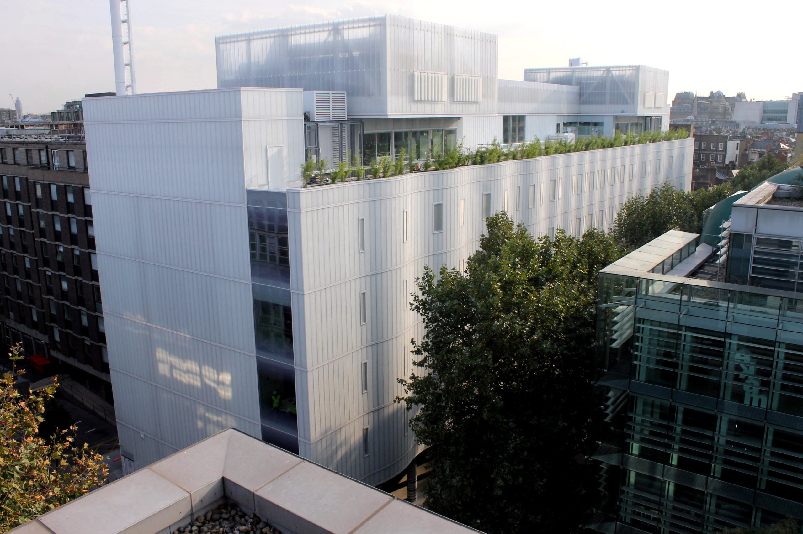
:::
:::

## Neuroinformatics Unit{.smaller}

::: {.columns}
::: {.column width="40%"}
- Sainsbury Wellcome Centre & Gatsby Computational Neuroscience Unit, UCL (London)

:::{.fragment}
- (Systems) neuroscience & machine learning **research software engineering** group
:::

:::
::: {.column width="60"}
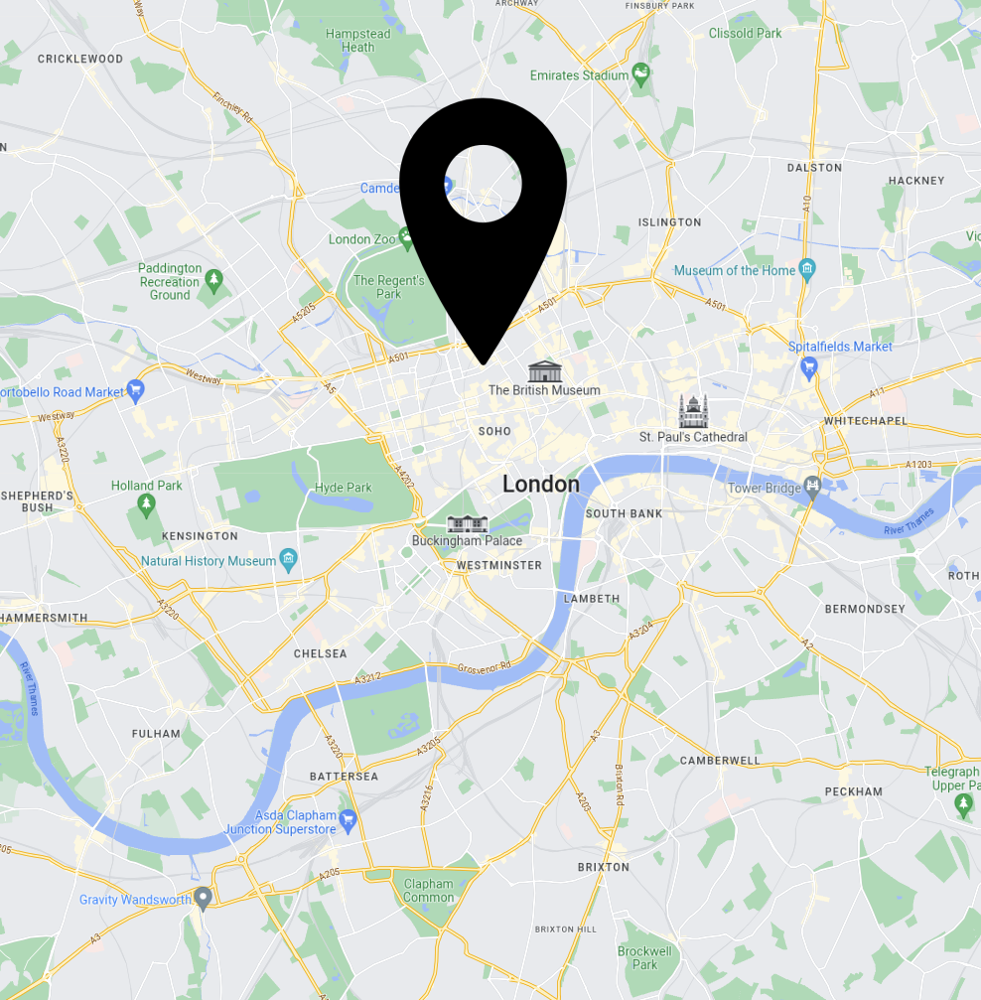
:::
:::


## What we do
:::{.incremental}
- **Data management** (specifications, tools)
- **Data analysis software** (anatomy, electrophysiology, functional imaging, behaviour)
- **Collaborations** (data science, software development, productionisation)
:::

## Current projects
:::{.incremental}
* Data standardisation and management
* Developer tools
* Modelling
* Extracellular electrophysiology analysis
* Computational neuroanatomy
* Video behavioural analysis
* Multiphoton imaging analysis
:::

## Current projects
* **Data standardisation and management**
* Developer tools
* Modelling
* Extracellular electrophysiology analysis
* **Computational neuroanatomy**
* **Video behavioural analysis**
* **Multiphoton imaging analysis**


# Data management

#
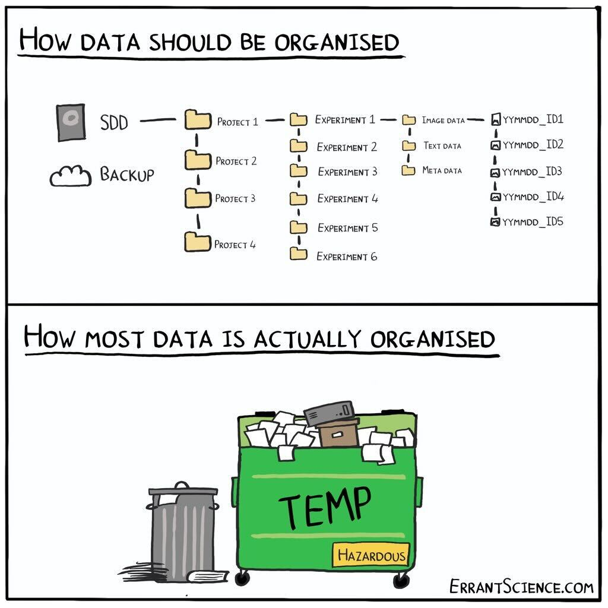{fig-align="center"}

::: footer
[errantscience.com](https://errantscience.com/)
:::

#
{fig-align="center"}

::: footer
[errantscience.com](https://errantscience.com/)
:::


## NeuroBlueprint specification {.smaller}


::: footer
[neuroblueprint.neuroinformatics.dev](https://neuroblueprint.neuroinformatics.dev/){fig-align="center"}
:::

## `datashuttle` {.smaller}


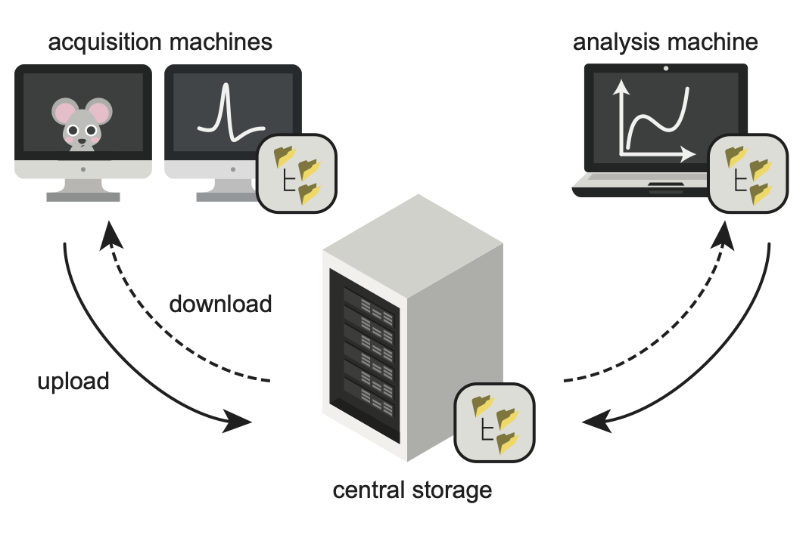{fig-align=left}


::: footer
[datashuttle.neuroinformatics.dev](https://datashuttle.neuroinformatics.dev/){fig-align="center"}
:::

## `datashuttle`

{fig-align=left}


# Anatomy
## BrainGlobe {.smaller}

::: {.columns}
::: {.column width="55%"}
Established 2020 with three aims:

:::{.incremental}
1. Develop general-purpose tools to help others build interoperable software
2. Develop specialist software for specific analysis and visualisation needs
3. Build an ecosystem and community of computational neuroanatomy tools and users
:::

:::
::: {.column width="45%"}
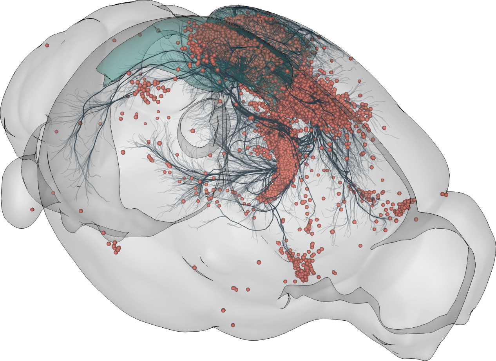
:::
:::


## BrainGlobe Atlas API
### [`brainglobe-atlasapi`](https://github.com/brainglobe/brainglobe-atlasapi)
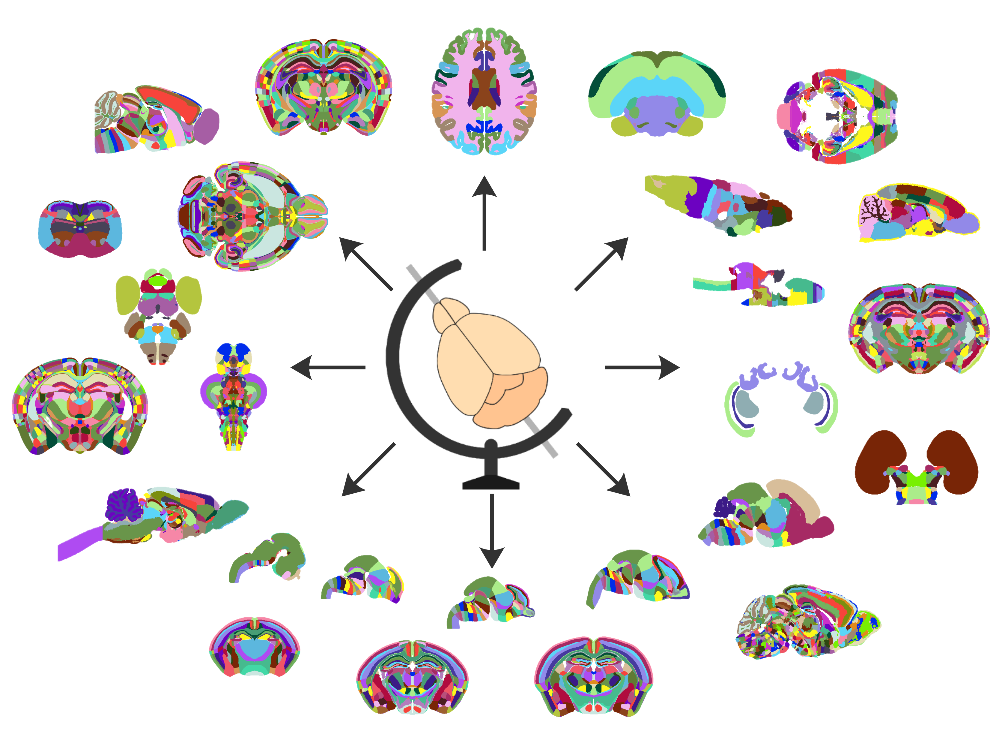{fig-align="center"}

::: footer
[Claudi, Petrucco, Tyson et al. JOSS (2020)](https://doi.org/10.21105/joss.02668)
:::

## Atlas registration
### [`brainreg`](https://github.com/brainglobe/brainreg)
### [`brainglobe-registration`](https://github.com/brainglobe/brainglobe-registration)
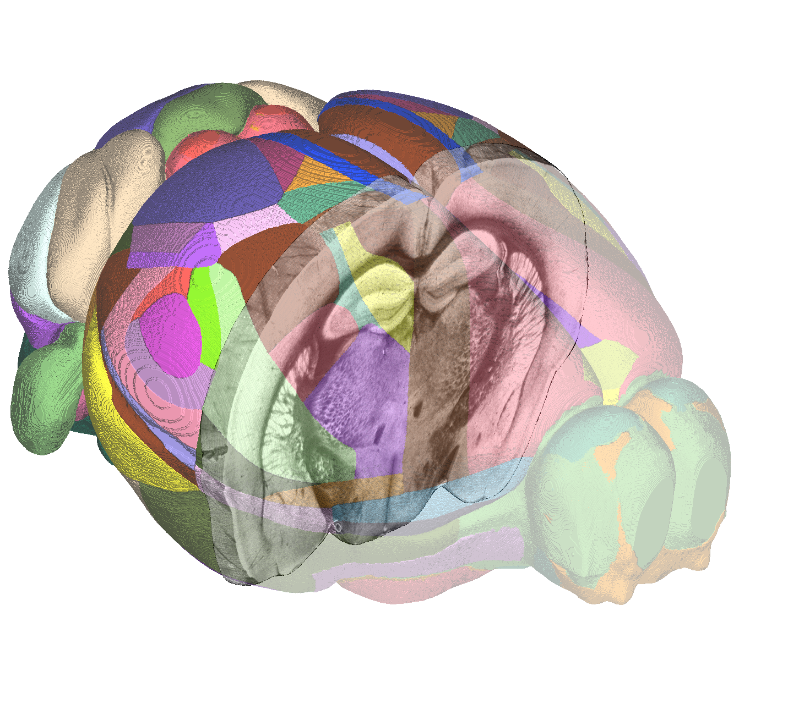{fig-align="center"}

::: footer
[Tyson, A. L., et al. (2022) “Accurate determination of marker location within whole-brain microscopy images” Scientific Reports, 12, 867](https://doi.org/10.1038/s41598-021-04676-9)
:::

::: footer
[github.com/brainglobe/brainglobe-registration](https://github.com/brainglobe/brainglobe-registration)
:::

## Spatial analysis

### [`brainglobe-segmentation`](https://github.com/brainglobe/brainglobe-segmentation)

{.nostretch fig-align="center" width="90%"}


::: footer
[Tyson, A. L., et al. (2022) “Accurate determination of marker location within whole-brain microscopy images” Scientific Reports, 12, 867](https://doi.org/10.1038/s41598-021-04676-9)
:::

## 3D cell detection

### [`cellfinder`](https://github.com/brainglobe/cellfinder)

{.nostretch fig-align="center" width="70%"}


::: footer
[Tyson, A. L. et al. (2021) “A deep learning algorithm for 3D cell detection in whole mouse brain image datasets" PLoS Comp Biol 17(5): e1009074.](https://doi.org/10.1371/journal.pcbi.1009074)
:::

## Visualisation

### [`brainrender`](https://github.com/brainglobe/brainrender)

{.absolute .nostretch top="23%" width="70%" left="15%" loop="true"}


::: footer
[Claudi, F. et al. (2021) “Visualizing anatomically registered data with Brainrender” eLife](https://doi.org/10.7554/eLife.65751)
:::


::: footer
[github.com/brainglobe/brainglobe-stitch](https://github.com/brainglobe/brainglobe-stitch)
:::

## More atlases
::: {.absolute left="0%" top="25%" style="font-size: 0.55em;"}
```{=html}
<table>
  <thead>
    <tr>
      <th></th>  
      <th>Atlas Name</th>
      <th>Species</th>
      <th>Data Available</th>
      <th>BrainGlobe</th>
    </tr>
  </thead>
  <tbody>
    <tr>
        <td>1</td>
        <td>Allen Mouse Common Coordinate Framework</td>
        <td>Mouse</td>
        <td>✅</td>
        <td>✅</td>
    </tr>
    <tr>
        <td>2</td>
        <td>Max Planck Zebrafish Brain Atlas</td>
        <td>Zebrafish</td>
        <td>✅</td>
        <td>✅</td>
    </tr>
    <tr>
        <td>3</td>
        <td>Duke Rat Atlas</td>
        <td>Rat</td>
        <td>✅</td>
        <td>❌</td>
    </tr>
    <tr>
        <td>4</td>
        <td>Canary Brain Atlas</td>
        <td>Canary</td>
        <td>✅</td>
        <td>❌</td>
    </tr>
    <tr>
        <td>5</td>
        <td>Population Based Ferret Brain Atlas</td>
        <td>Ferret</td>
        <td>✅</td>
        <td>❌</td>
    </tr>
    <tr>
        <td>6</td>
        <td>Normal Feline Brain atlas</td>
        <td>Cat</td>
        <td>❌</td>
        <td>❌</td>
    </tr>
    <tr>
        <td>...</td>
        <td>...</td>
        <td>...</td>
        <td>...</td>
        <td>...</td>
    </tr>
    <tr>
        <td>168</td>
        <td>Tawny Dragon Lizard Brain Atlas</td>
        <td>Tawny Dragon</td>
        <td>✅</td>
        <td>❌</td>
    </tr>
    <tr>
        <td>169</td>
        <td>Squirrel Monkey Brain atlas</td>
        <td>Squirrel Monkey</td>
        <td>✅</td>
        <td>❌</td>
    </tr>
    <tr>
        <td>171</td>
        <td>Pigeon Brain Atlas</td>
        <td>Pigeon</td>
        <td>✅</td>
        <td>❌</td>
    </tr>
  </tbody>
</table>
```
:::


::: {.footer}
[https://github.com/brainglobe/brainglobe-atlasapi](https://github.com/brainglobe/brainglobe-atlasapi)
:::

## Building novel atlases
### [`brainglobe-template-builder`](https://github.com/brainglobe/brainglobe-template-builder)
{fig-align="center"}

 Eurasian blackcap (Sylvia atricapilla)

::: footer
[Sirmpilatze, Felder, Abdulazhanova et al. Current Biology (2026)](https://doi.org/10.1016/j.cub.2026.03.034)
:::

# Behaviour


## Markerless pose estimation


:::: {.columns}

::: {.column width="60%"}
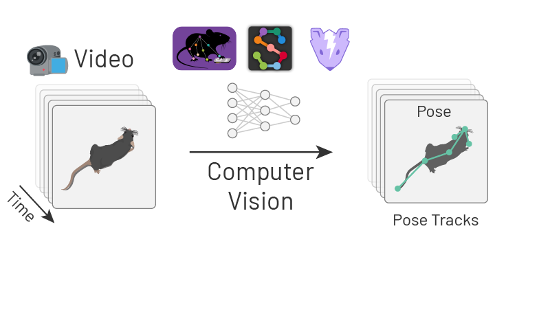
:::

::: {.column width="40%"}
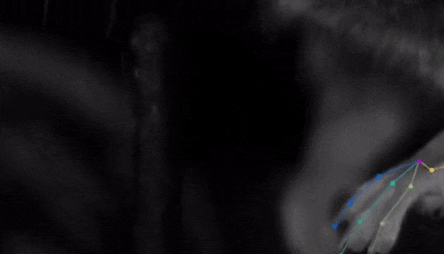
:::
::::


## What happens after tracking?


## `movement`{.smaller}

{height=450}


::: footer
[movement.neuroinformatics.dev](https://movement.neuroinformatics.dev/)
:::


## PoseInterface
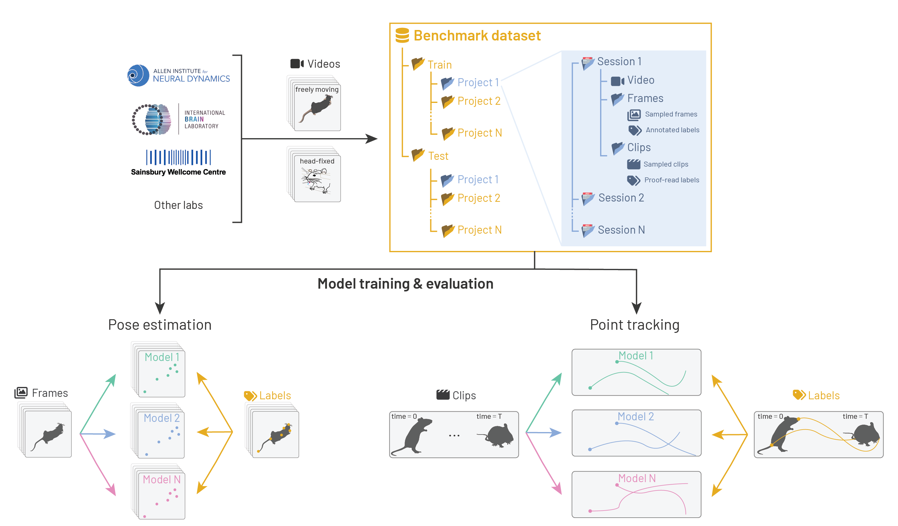{fig-align="center"}

::: footer
[poseinterface.neuroinformatics.dev/](https://poseinterface.neuroinformatics.dev/)
:::

# Functional Imaging


## photon-mosaic
{fig-align="center"}

::: footer
[github.com/photon-mosaic](https://github.com/photon-mosaic)
:::

# Long-term priorities


# Thanks

## Support

{fig-align="center"}

## Team {.smaller}

::: {layout-nrow=2}

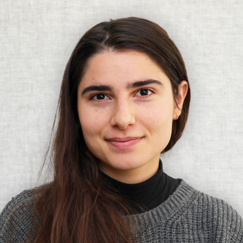


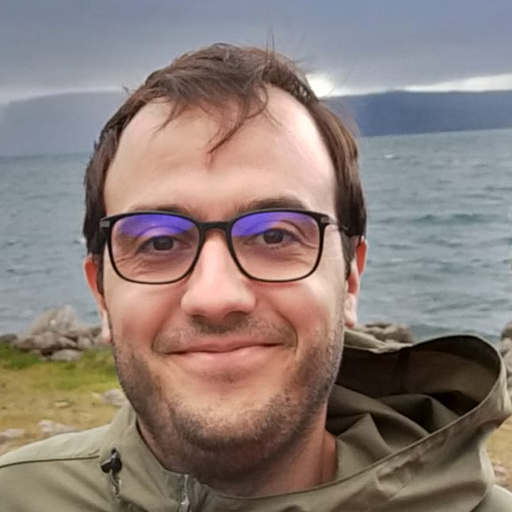

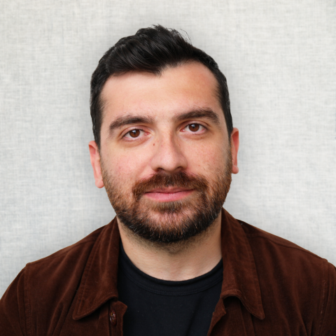


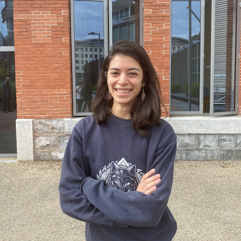


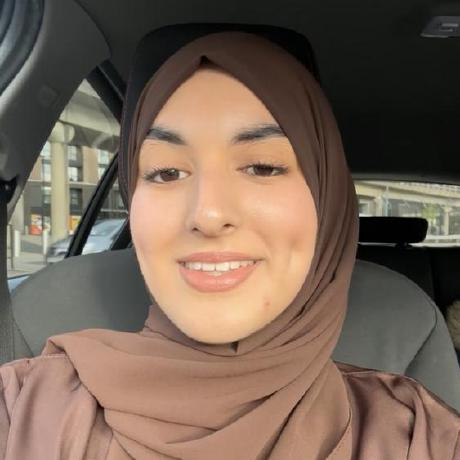

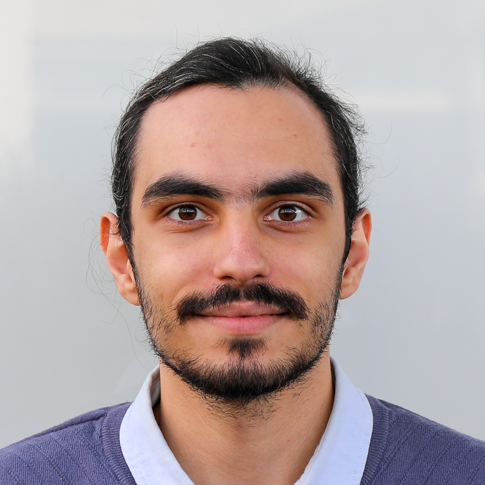


:::

## Contributors

::: {style="font-size: 45%;"}

Will Graham, Patrick Roddy, Adrien Berchet, Mathieu Bourdenx, bkntr, NovaFae, David Young, Sam Clothier, Gubra-ApS, Kailyn Fields, ramroomh, Samuel Diebolt, Chris Roat, Oren Amsalem, kclamar, Draga Doncila Pop, juanma9613, Jules Scholler, Iaroslavna Vasylieva, Nicolas Peschke, Justin Kiggins, Peter Sobolewski, Simão Bolota, chili-chiu, jaimergp, Sebastian Lammers, Matt Colligan, Paul Brodersen, Carter Peene, francesshei, Sean Martin, Ben Dichter, 4iar, Marco Musy, Anna Medyukhina, stegiopast, EmanPaoli, lidakanari, Alexis Arnaudon, Ziyang Liu, Philip Shamash, Christian Niedworok, Charly Rousseau, Horst Obenhaus, Chryssanthi Tsitoura, Sepiedeh Keshavarzi, Mateo Vélez-Fort, Stephen Lenzi, Rob Campbell, Alessandro Felder, Federico Claudi, Luigi Petrucco, Adam Tyson, Troy Margrie, Tiago Branco, Ruben Portugues, Joe Ziminski, Sofia Miñano, Niko Sirmpilatze, Nicholas Del Grosso, Laura Porta, Lee Cossell, Antonin Blot, David Pérez-Suárez, David Stansby,  koushik-ms, Harald Reingruber, Emily Jane Dennis, Peak, Maximilian Blacher, Hernando Martinez Vergara, Estelle, nicole-vissers, GD, Michael Kunst, Estelle Nassar, Sara Mederos, Igor Tatarnikov, Viktor Plattner, Carlo Castoldi, Jingjie Li, Guillaume Le Goc, Harry Carey, Matt Einhorn, Kimberly Meechan, Robert Kozol, Roberto, Axel Bisi, Jung Woo Kim, Saima Abdus, Saarah Hussain, Sacha Hadaway-Andreae, Presa, Henry Crosswell, Nischit Kumar, Kirato Yoshihara, Leonard Schwigon, Dinora Abdulazhanova, Katrin Haase, Dominik Heyers, Isabelle Museliak, Henrik Mouritsen, Simon Weiler, Stella Prins, Richard Dushime, Miguel Xochicale, M S P, Abdul Samad, Prisha Sharma, Farida Yusuf, Anshu Saini, Menna1812, ayush2281, BethCr, Swapnaneel Patra, Xiaoyu Deng, DwarvesEatRocks, DPWebster, Conrad, pranav33317, Biswanath Saha, Federico F., Tim Monko, Kaixiang Shuai, Giulia Paci, Marco Dalla Vecchia, Pavel Vychyk, Ishrat Zaman, Fatma S. Elsharkawy, Chang Huan Lo, Pascal Malkemper, Alireza Saeedi, Nasibeh Amini, Aref hossein Akhlaghi, Li Zhang, Leoni-Marie Webb, Nishanth B, Ardavan Shahrabi, Varun Singh, Harshdip Saha, sid-42-d, James Rowland, Kavyashah067, Aditya Gupta, Luigi Meola, Ajitesh Kumar Singh, Chandrika, Hargun Kaur, Rahul Bera, Hashbrownsss, Divyansh Gupta, Yaroslav Halchenko, Bhanushali Parth Hitesh, Harsh Bhanushali, Tushar Verma, maxstaras, Akseli Ilmanen, Lakshmi Sowmya, Sparshr04, Shigraf Salik, Vedant Vakharia, ishan372or, Holly Morley, Parth Chatupale, Shreecharana N, Eric Denovellis,  Iván Varela, Vaco Schiavo, Laura Schwarz, Mohamed Reda, Mikkel Roald-Arbøl, Sanjana Soni, vybhav72954, Kasra Shirvanian, Kunal Dadlani, Dhruv Yadav, angkul07, Eduardo Augusto, CeliaLrt, Animesh Sasan, Tushar Das, Dhruv Sharma, Ishaan Shaikh, Brandon Peri, Shrey Singh, Damacharla Sushma, Sumana Sree Angajala,  Shreejan Dolai, Aryan Srivastava, Alexandro Berumen, Sergio Valbuena, Matthew Scroggs, kawaho4, Andrew Moffitt, Ankush Agarwal 
:::
